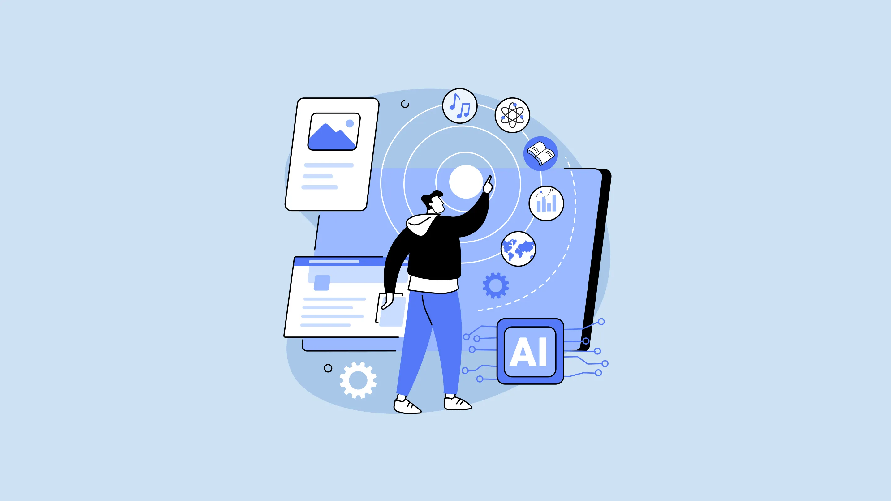

 

## Introduction

With the recent popularity of AI use in general we can find a great deal of uses for AI in various fields. In my ICS 314 class, we were allowed to use AI to assist our work. Tools like ChatGPT can be helpful when used correctly.

## Class Use of AI

#### WODs

In class, we have WODs (workout of the day) which are some programming exercises that help build and test the foundation of your code understanding. We were allowed to use AI tools in WODs including experience WODs, in-class practice WODs, and in-class WODs. Experience WODs are assignments that build a basic understanding of what you are learning. Since the solutions of the experience WODs were provided, I found it helpful to watch the solution video instead of using AI. Maybe if there was something that I couldn’t understand, it would help me understand it more by asking the AI to explain what was going on in the code. In-class practice WODs are done in class to prepare us for the in-class WODs which are graded. In this case, I was able to find some use of AI, mainly to help me with providing some answers for this since solutions are not available outside of class. As for in-class WODs, I haven't found a way that it can be helpful. You would need a specific understanding of the code to even complete these WODs so providing the entire program would be hard. But, the program could be broken down into smaller pieces to understand the parts you are stuck on.

#### Writing Code

Whenever I tried using AI to write code, my program wouldn’t run since it is not an almighty tool. The program would need some tweaks. However, I was able to find the use of AI to be helpful since I was able to get hints. With those hints, I was able to search what I was trying to look for on Google. For me, it was like having 2 search engines one helping you with what you're trying to find and one to give you more information. For example, I remember being stuck adding a table using HTML, so I asked ChatGPT to help me find how to do that. After knowing how to do that, I was able to search for further information on how other people implement it, which gave me a clear understanding of what goes on with that line of code.

#### Questions

Whenever students have a hard time understanding or resolving an issue, our ICS 314 class uses a Discord server to ask for help from other students or TAs. I remember people showing screenshots of the error they had. Sometimes, some questions can easily be solved by asking the AI. I was surprised at how it can sometimes precisely tell you what is wrong with a specific issue and what error you have. If you ask ChatGPT to read a line of code that you don’t understand, it can help you document or explain it to you. With the combination, you can get as much feedback and understanding of the code much possible while being able to fix the issue with your line of code.

#### Impact on Learning and Understanding 

I can admit that the use of AI tools is really useful when you want to pin down what you are trying to find. I saved a lot of time because of this. It allowed me to focus on my work rather than spending hours just looking things up. Although I wouldn’t trust all the things that are generated from AI, I think some are valuable information you should take with a grain of salt. As there are no citations of where the information is coming from you could be directly plagiarizing or it could be entirely wrong. I think it can be unhealthy if you decide to use this excessively and this as the only source of information. I still feel comfortable taking actual advice from humans instead of AI. 

## Outside of Class

Where I found AI to be useful was outside of class. I found myself using AI to help me simplify things like documents or specific instructions from an assignment like things that were not the most understandable. The current stage of AI isn’t entirely reliable but if I have one tool that I find valuable is Grammarly. Grammarly is an AI writing assistant that can help improve your writing in real-time. Grammarly provides grammar and style suggestions that improve overall writing quality. I haven’t viewed this tool as an AI assistant but knowing more about AI in general, I find it interesting that I have already been incorporating AI technology into my daily life. 

## Conclusion

In conclusion, I think AI at this point is a tool that is meant purely to assist you instead of relying on it. Since there’s nothing that can be done to prevent the advancements in technology, it is probably important to keep in mind that AI is just starting and only getting better. Knowing how to use it inside and outside of the classroom might be important to know. I don’t want to rely on AI purely because I feel some skills can be lost if you just get the answers you want as quickly as a second. 
