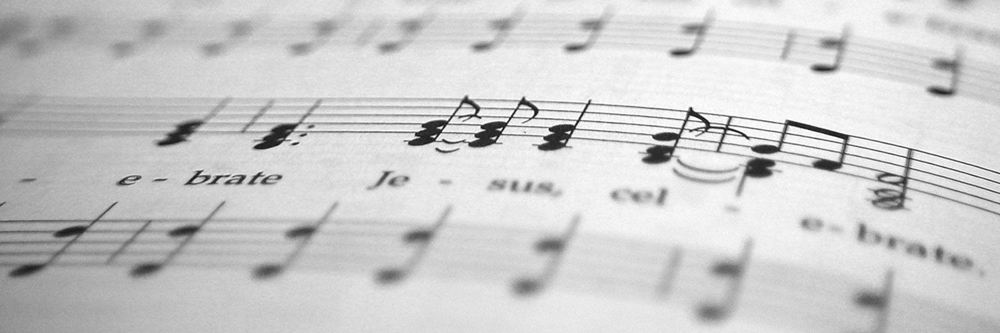

## Understanding Design Patterns with Music Theory

When you are listening to music, you may hear some songs have a similar rhythm or similar chord progressions. This is similar to design patterns in software design. Design patterns are a general solution for a recurring problem in software design. Design patterns only offer you a general solution, which means that it is not always the same in every code you find. They give a foundation that you can build off of and can be customized to solve a recurring design problem in your own code.

An artist might use a similar musical rhythm in their song but it isn't just a simple process where you can mash everything and hope for the best that it sounds good together. Music theory provides you with a basic understanding of how music is constructed but isn't the answer to everything. It often takes many considerations and understanding of music theory to produce good music. Understanding music theory will allow you to create a certain tone or mood depending on how you want your music to sound. Similarly, the implementation of a design pattern often needs consideration and is not just a copy-paste solution. Artists often put their own twist on their music to differentiate from other artists. Similarly, you can follow the pattern details and implement a solution that suits the realities of your own program.

## How you can Implement it

Just as a music producer combines notes and melodies to make music, a developer combines design patterns to compose an efficient and well-structured piece of code. For example, the Factory Method pattern can be likened to selecting the right instruments for a composition. It provides a framework for creating objects but allows the details of their creation to be adaptable and changed, much like how the choice of instruments can influence the overall sound of a musical piece. I've used design patterns like the Factory pattern in a group project that I am currently working on.

## Conclusion 

Just as a musician draws from music theory to create a captivating piece, a developer leverages design patterns to build robust and scalable software. These patterns offer a foundation, much like musical notes, that can be combined and customized to address specific challenges in software design. However, just as no two musical compositions are identical, just like no two implementations of a design pattern need to be the same. Developers, like musicians, bring their unique perspectives and creativity to the table, infusing their work with individuality and innovation. 