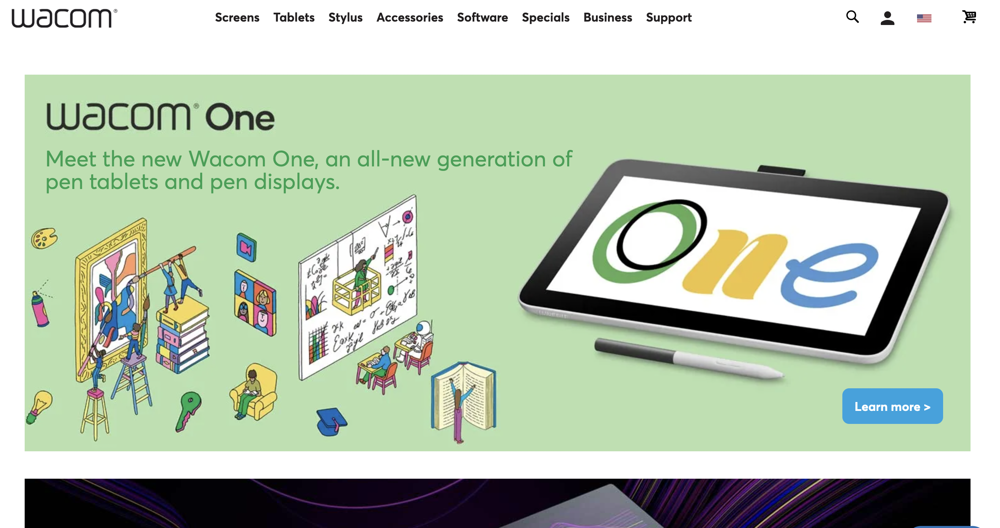
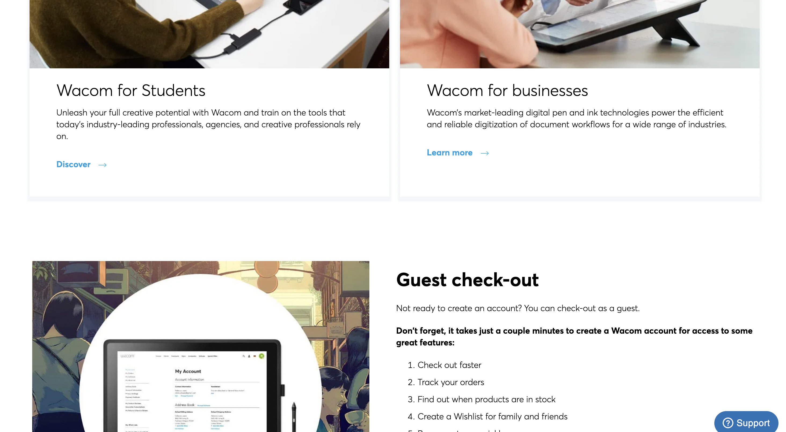
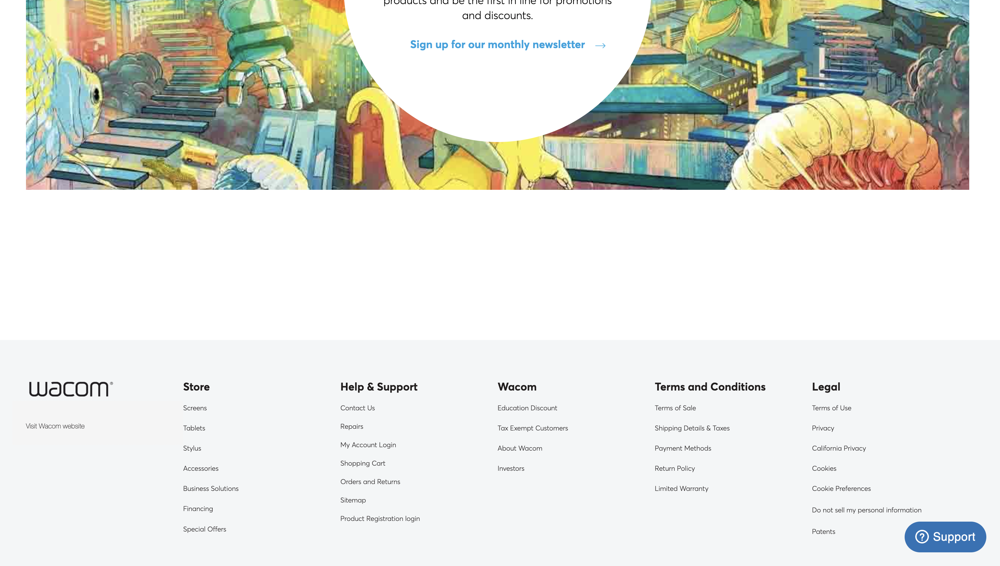
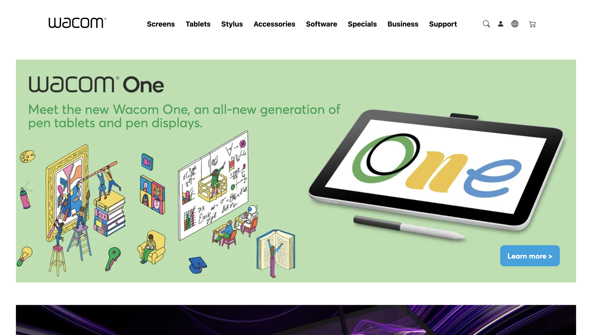
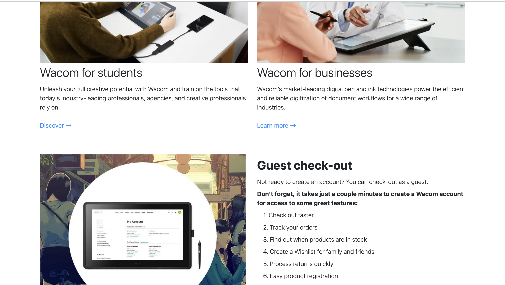
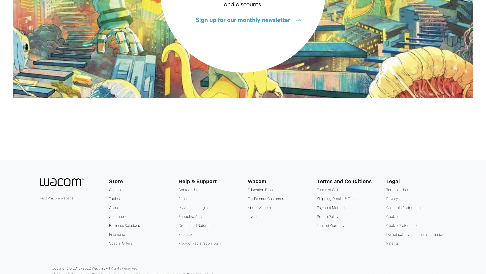

## UI Frameworks

User interfaces, or UIs, are everything that ranges from menus, buttons, icons, and basically anything that you interact with on a device or a webpage. UIs play an important role in ensuring that a user can efficiently interact with that device or webpage. A well-designed user interface allows users to perform tasks like navigating through a website more efficiently and pleasingly. 

For developers, UI frameworks are important components for making things like websites more user-friendly. UI frameworks provide pre-written codes through CSS classes that allow developers to implement pre-designed UI templates like buttons or icons with ease. 

Using frameworks is not as easy as it sounds, it usually takes as much effort as learning a new language. So why would you want to take the time to use UI frameworks over the raw HTML and CSS? Because it's much easier and faster once you know how they work. They are pre-designed so that we don’t have to struggle with building things manually. Building a website just with HTML and CSS can be really frustrating since you may come across many errors and it can be a time-consuming process.  It would also cut down on how much code you will have to write.

## Bootstrap 5

​​​​​​​Bootstrap 5 is one of the most popular frameworks for web development. Bootstrap offers modern and aesthetic UI designs that are user and developer-friendly. My experience with it so far has been really exciting and fun to use. I’ve never wondered how websites are made but learning how to use HTML, CSS, and UI frameworks was really fascinating. While it may be hard to know everything about Bootstrap, I really love how easy it is to implement once you know about it. Bootstrap also has guides to how to use every component and some of them are really easy to understand. Overall, I am really happy that I discovered these tools.

## Recreation of a Website

In my ICS 314 class, we were given an assignment to recreate a website of your own choice and for that assignment, I chose to recreate the [Wacom online store](https://estore.wacom.com/en-us/?gclid=EAIaIQobChMI06COhrzegQMV_w2tBh0iLAhjEAAYASAAEgKG8fD_BwE). 

Real Website:

Recreatioin of Website: 

