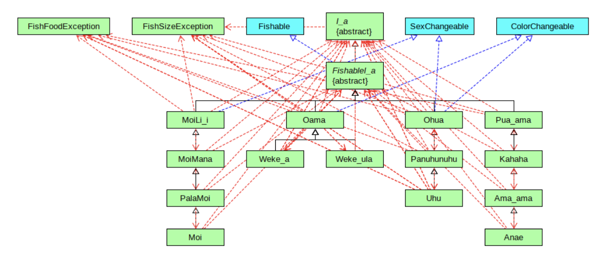

The Fish Game was a final group project given to me in my ICS 211 class. The Fish Game is essentially like real fishing where you can catch a fish. This game allows you to cast out for a fish, view the sack of fishes, or you can release the fish. The game part was that there are illegal fishes and legal fishes. If you throw the legal fish into the sack you can keep it but if it was an illegal fish, all of the fishes you caught will be released. 

The biggest challenge I faced with this project was teamwork. It was necessary for us to divide the project in a way that each person works on one fish family in order for us to finish on time. The difficult part of this project was the different classes and arrays. We had to implement a child class, a parent class, and a superclass, each having their own data; on top of that, they each had to be sorted based on their sizes.  

Through this project, I learned communication is a must when it comes to coding in a team setting. I would like to think this is how it is in a professional setting where one person is given a certain task to do. This experience has taught me to be more responsible for myself and others. Overall, I am really happy with how this project turned out because it has taught me more about Java and data structures. 
