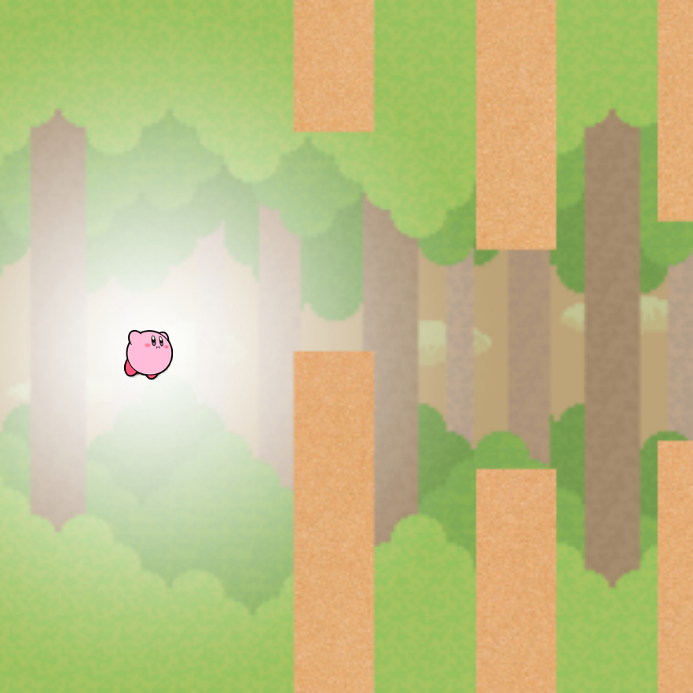

Flappy Bird is the second project I decided to work on by myself during summer break. My version of Flappy Bird was coded using the language GDScript on Godot. I based this off a video I found online. I didn’t want to copy everything that was done in the video so I made my version Kirby themed.  

The hardest part of this project was getting everything to work how it was in the video. This took the most effort because the update of Godot made most of the code outdated so it would just cause errors when you try to copy it. I had to search all of the errors individually to see how to fix my code. 

I recommend this short project to anyone who is interested in making a game with simple graphics. I think [this video](https://www.youtube.com/watch?v=Kt1njjNGbSg) was the best in describing all the functions for the game despite it being short and outdated. The outdated version of the code made it a more challenging experience. I recommend checking out other videos as well because there were some updated versions of this project. 
