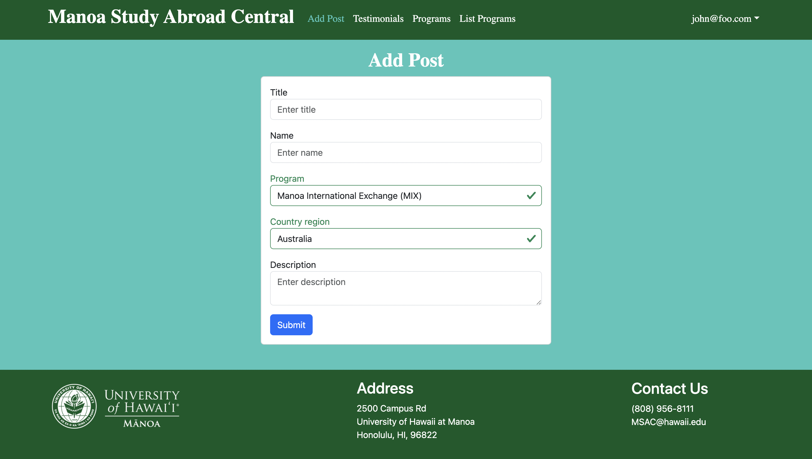
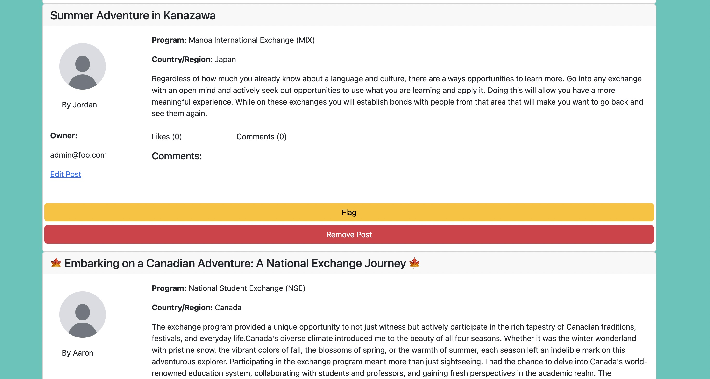

### Overview

Manoa Study Abroad Central is an application that I developed for my final project in my ICS 314 class, collaborating with several group members. This digital platform is dedicated to showcasing the various study abroad and exchange programs offered at UH Manoa. With UH Manoa providing several programs, selecting the most suitable one can be challenging for students. Manoa Study Abroad Central aims to be a user-friendly website designed to assist students in exploring different programs, including the Manoa International Exchange (MIX), Study Abroad Center, and National Student Exchange programs, all conveniently accessible on one site. The platform includes posts from UH Manoa students sharing their experiences in specific programs, providing valuable firsthand insights. These insights will hopefully offer perspectives on the benefits and potential challenges associated with each option.

### Tasks

In this project, I was tasked with doing most of the post functions available on the site. In the "Add Post" tab, students can contribute by entering the title of their post, their username, the program they participated in, the country they visited, and a detailed description of their experiences. This would be displayed on the "Testimonials" page which is a collection of posts where you can comment and like posts you thought were interesting. The comments are there to be able to ask questions or to provide feedback on posts.

I was also responsible for developing the "Admin Post" page, where moderation of posts on the "Testimonials" page is managed. Access to the admin pages is restricted to admin accounts for security reasons. The flag button functionality allows the flagging of inappropriate posts. Flagged posts will subsequently be hidden from the user pages. The "remove post" option is designed to completely delete a post, offering a more comprehensive moderation tool. Additionally, administrators have the ability to remove inappropriate comments associated with the posts.

### Conclusion

Overall, I had a lot of fun building the website. It provided me with a glimpse into the world of web development, helping me understand the tasks that web developers typically undertake. The experience contributed to the development of various skills, including proficiency in different frameworks and programming languages. The most valuable aspect of this experience was working collaboratively with a team and gaining exposure to various frameworks and software tools. I believe this project has broadened my understanding and appreciation for the field of computer science. 

### Links 

[Home page](https://manoa-study-abroad-central.github.io/),
[Github organization](https://github.com/manoa-study-abroad-central/manoa-study-abroad-central.github.io/tree/main)