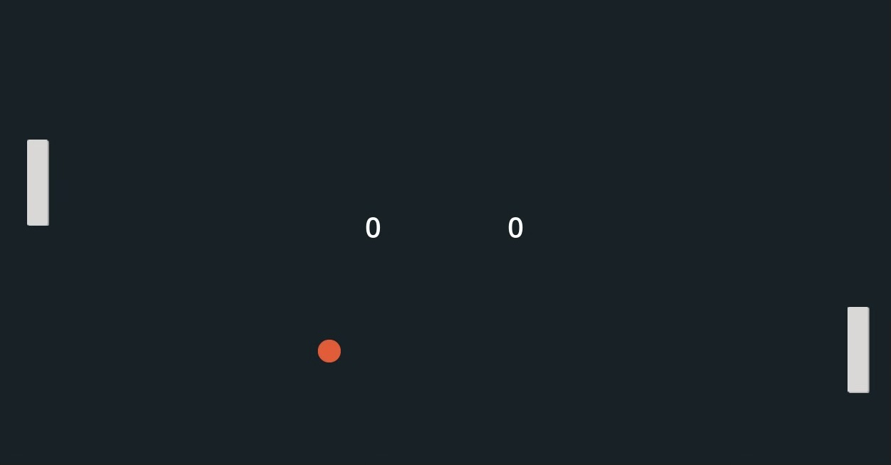

Pong is my first game that I made using the software Godot. In Godot, you will use the language called GDScript to program all the movements. You can implement the game designs into Godot directly; for example, the paddle and ball in this case. Writing in GDScript was very interesting to me because many say that GDScript is similar to Python. 

My first challenge I encountered while making this game was getting used to the language. GDScript was a new language to me but thanks to the internet, all the resources were out there to get me started. Since Pong is a relatively simple and popular game, there are many versions to get inspiration from. My second challenge I encountered was the update of Godot. With the new update of Godot, most of the code is outdated which made it harder for me as a beginner. 

Ultimately, I managed to make a functional version and it was a very satisfying experience to see your creation come to life. My favorite part of this project was to work on the opponent AI because I got to see how a very simple form of AI is made. This made me interested in programming even more. 

This is the [video](https://www.youtube.com/watch?v=kr1BoEbuveI)  that I based my code off of. 
